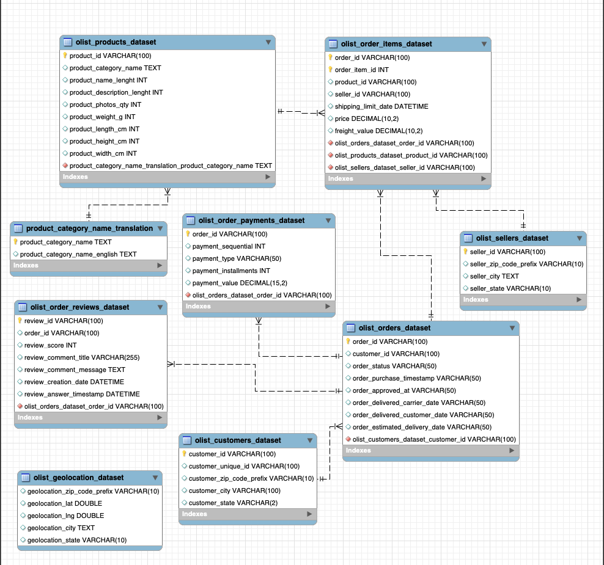
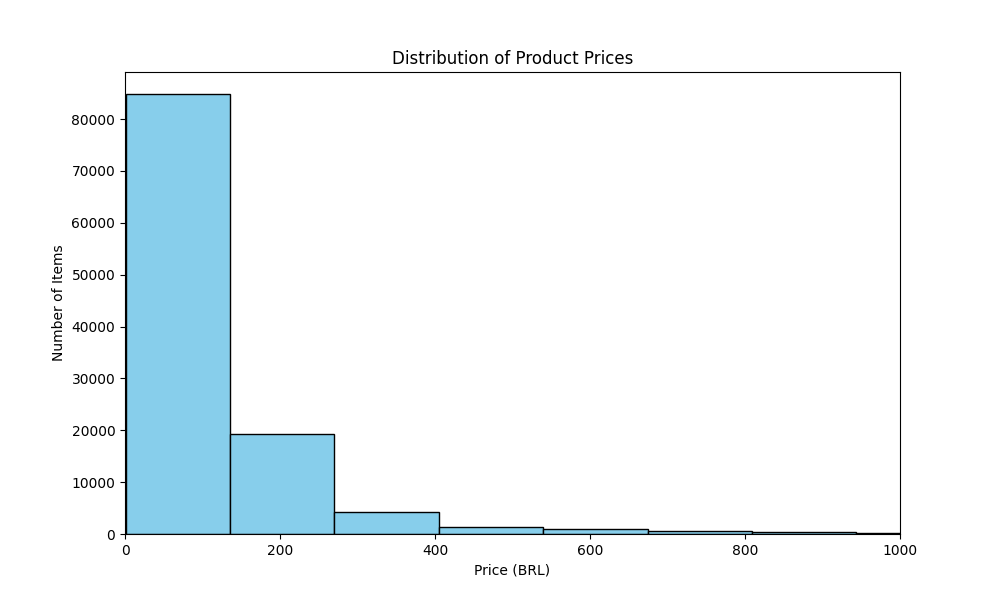
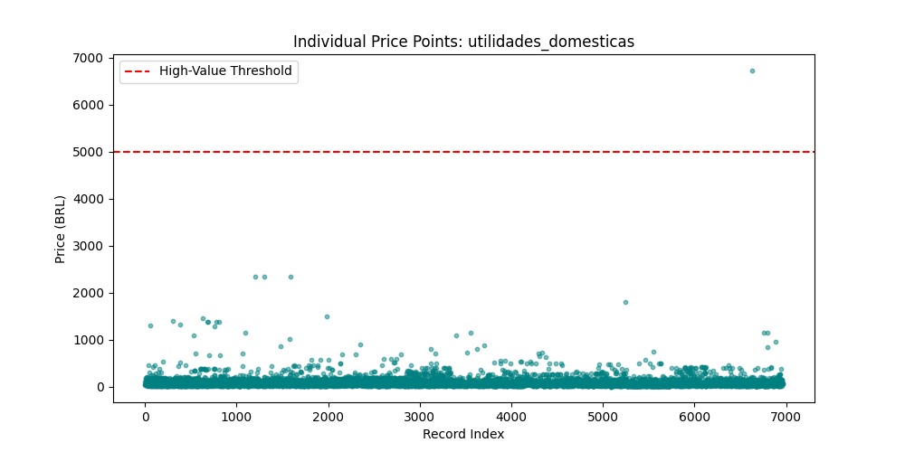

# Case Study: Olist Brazilian E-Commerce 🇧🇷

## Project Overview
This project involves a comprehensive analysis of the Olist e-commerce dataset, focusing on delivery performance and price validation. I have engineered a robust ETL pipeline and performed deep-dive data audits to ensure data integrity before visualization.

## Current Progress: Phase 3 (Data Cleaning & Statistical Validation)
I have successfully transitioned from data auditing to advanced cleaning, managing a high-volume ecosystem of **100,000+ transaction records**.

### 🚀 Key Technical Achievements:
* **Relational Modeling:** Engineered a primary/foreign key schema to link orders, products, and sellers.

* **Python ETL Pipeline:** Developed an automated script (`app.py`) using **Pandas** and **SQLAlchemy** to convert VARCHAR timestamps into DATETIME objects and perform cross-table price validation.
* **Data Integrity & "Orphan" Resolution:** Resolved **1,603 uncategorized sales** by identifying **610 "orphan" Product IDs** and implementing a categorical mapping strategy (naming them 'Uncategorized') to ensure 100% revenue reporting.
* **Advanced Outlier Detection (IQR):** Utilized the **Interquartile Range (IQR)** method in Python to mathematically analyze the *utilidades_domesticas* category.
    * **Finding:** Identified **395 statistical outliers** exceeding a price threshold of **237.24 BRL**.
    * **Strategy:** Opted to retain these records to preserve total revenue integrity while utilizing **Median** metrics for visualization to prevent skewed averages.

## 📊 Visual Analysis

*Figure 1: Histogram showing the distribution of product prices across 100k+ records. The concentration of items under 200 BRL justifies the use of Median metrics for skewed data.*

*Figure 2: Scatter plot identifying the $6,644 price gap and resulting 395 statistical outliers.*

## 📂 Repository Structure
* `/sql_scripts`: Contains `Olist_Project.sql` (architecture) and `olist_audits.sql` (analysis).
* `app.py`: Python framework for data processing and statistical validation.
* `olist_final_cleaned_data.csv`: The "Golden Dataset" exported for Power BI visualization.

## 🛠️ Tech Stack
* **Database:** MySQL
* **Languages:** SQL, Python (Pandas, NumPy, Matplotlib)
* **Tools:** VS Code, MySQL Workbench, Git